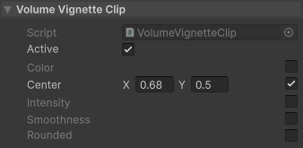

# DOTS Clip Override Pairing

DOTS clip editors automatically pair boolean override flags with a value field to
show a single toggle + value row in the Inspector.

## How it works
- The editor scans serialized fields for boolean "override" flags.
- When an override flag is found, it looks for a value field with the same suffix.
- If a matching value field exists, the override toggle is shown next to that field.

## Supported naming formats
Override flags can use these prefixes (case-insensitive):
- override
- Override
- _override
- _Override
- m_override
- m_Override

The paired value field uses the same suffix after "override". The editor tries
both lower- and upper-cased first letter (and uses the prefix case to choose
which to try first).

## Examples
- overridePosition -> position / Position
- OverrideScale -> Scale / scale
- _overrideSpeed -> _speed / _Speed
- m_OverrideColor -> m_Color / m_color

## Notes
- Only boolean override fields are considered.
- The override flag must have at least one character after "override".
- If no matching value field exists, the override flag is ignored.
