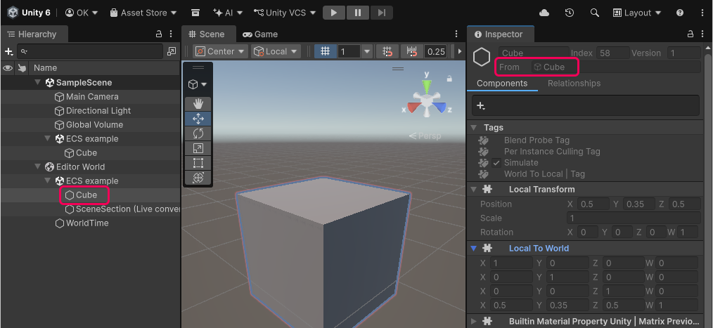
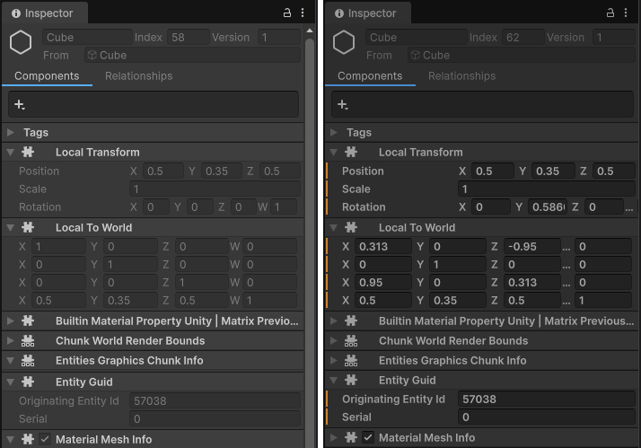
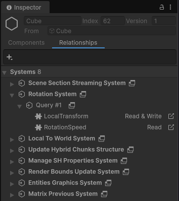

# Entity Inspector reference

When you select an entity in the [Hierarchy window](https://docs.unity3d.com/6000.5/Documentation/Manual/new-hierarchy.html) with the [**Use new Hierarchy window**](https://docs.unity3d.com/6000.5/Documentation/Manual/Preferences.html#hierarchy-window) option enabled, the [Inspector](https://docs.unity3d.com/Manual/UsingTheInspector.html) displays information about that entity.

 _Entity Inspector view with an Entity selected in Hierarchy_

To view the authoring data for a GameObject that an entity was converted from, select the GameObject in the **From** field of the Inspector.

The Entity Inspector has two tabs: **Components** and **Relationships**.

## Components tab

The **Components** tab displays all the [components](concepts-components.md) on the selected entity, similar to how the Inspector displays MonoBehaviour components on a GameObject.

The fields in the **Components** tab have two states:

* In Edit mode, they're read-only.
* In Play mode, you can edit them for debugging purposes. When you exit Play mode, the [baking](baking-overview.md) process overrides any changes you made.

The orange or red vertical bars next to fields indicate data that does not persist between the modes (the color of the bar depends on the Editor theme).

 _Entity Inspector in Edit mode (left), and Play mode (right). The orange vertical bars in Play mode indicate that Unity destroys the data when you exit Play mode._

## Relationships tab

The **Relationships** tab displays the [system queries](systems-entityquery.md) that match the selected entity. This view also displays the system's access rights to the components (**Read** or **Read & Write**).

Click the icon to the right of a system or component name () to change the selection to that system or component. For systems, Unity highlights the system in the [Systems window](editor-systems-window.md) if the window is open. For components, Unity opens the [Component Inspector](editor-component-inspector.md) where possible.

To view a list of all the entities that match a query, click on the icon () next to a query. Unity opens the [Query window](editor-query-window.md).

 _Entity Inspector Relationship tab_

## Additional resources

* [Entities user manual](concepts-entities.md)
* [Hierarchy window reference](editor-hierarchy-window.md)
* [System Inspector reference](editor-system-inspector.md)
* [Component Inspector reference](editor-component-inspector.md)
* [Query window reference](editor-query-window.md)
