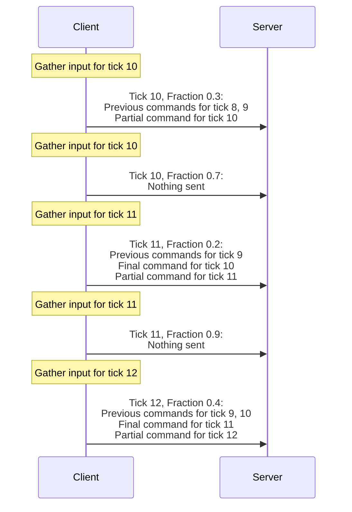
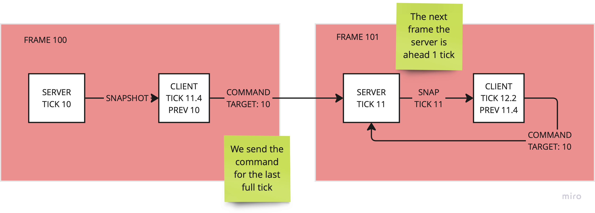

# Command protocol

The client starts sending the `Command` packet after the `NetworkStreamConnectionInGame` is added to the `NetworkStreamConnection`
entity.

The client will gather inputs in the input system group. The command system will gather the inputs, and send them on the first partial tick of each full tick, which will include the final full command for the previous tick, a partial command for the current tick, and the last couple of commands for the previous ticks (set by `ClientTickRate.NumAdditionalCommandsToSend`).
The client sends the last couple of commands (set by `ClientTickRate.NumAdditionalCommandsToSend`), so when the client simulates a new ServerTick, it will send the actual final command for the previous tick, while gathering input for the current tick as well.
The server will then receive those commands and store them in a buffer before consuming them. So it can update existing commands if it receives multiple commands for the same tick. In most cases, the server will already have received the final command for a tick, so it will ignore any previous partial commands for that tick.

While the client uses partial ticks, the command itself does not, as they are tied to specific server ticks that the server uses to simulate that tick.



## Issue with commands and Local Hosting

Command can be lost when using local hosting (bad issue)



> Reason: we inverted the server and client world update. The correct order is
> update the ClientWorld first and then the ServerWorld. This has also other advantages
> and motivation. But that fix this and other problems.

``` text
    CLIENT ---> COMMAND TICK X --> SERVER (SIM TICK X)
      A                                              |
      |                                              |
      |-----------SNAPSHOT TICK X -------------------V
```

## PACKET FORMAT
```text
<----------------------- 32 bits ------------------------------->
0 1 2 3 4 5 6 7 0 1 2 3 4 5 6 7 0 1 2 3 4 5 6 7 0 1 2 3 4 5 6 7
+-+-+-+-+-+-+-+-+-+-+-+-+-+-+-+-+-+-+-+-+-+-+-+-+-+-+-+-+-+-+-+-
MSG TYPE      | LAST SNAPSHOT TICK                             |
+-+-+-+-+-+-+-+-+-+-+-+-+-+-+-+-+-+-+-+-+-+-+-+-+-+-+-+-+-+-+-+-
 ...          | SNAPSHOT ACK MASK                              |
+-+-+-+-+-+-+-+-+-+-+-+-+-+-+-+-+-+-+-+-+-+-+-+-+-+-+-+-+-+-+-+-
 ...          | LOCAL TIME                                     |
+-+-+-+-+-+-+-+-+-+-+-+-+-+-+-+-+-+-+-+-+-+-+-+-+-+-+-+-+-+-+-+-
 ...          | RETURN TIME                                    |
+-+-+-+-+-+-+-+-+-+-+-+-+-+-+-+-+-+-+-+-+-+-+-+-+-+-+-+-+-+-+-+-
 ...          | INTERPOLATION DELAY                            |
+-+-+-+-+-+-+-+-+-+-+-+-+-+-+-+-+-+-+-+-+-+-+-+-+-+-+-+-+-+-+-+-
 ...          | NUM LOADER PREFAB                              |
+-+-+-+-+-+-+-+-+-+-+-+-+-+-+-+-+-+-+-+-+-+-+-+-+-+-+-+-+-+-+-+-
 ...          | TARGET TICK                                    |
+-+-+-+-+-+-+-+-+-+-+-+-+-+-+-+-+-+-+-+-+-+-+-+-+-+-+-+-+-+-+-+-
 ...          | COMMAND DATA                                   |
 +-+-+-+-+-+-+-+-+-+-+-+-+-+-+-+-+-+-+-+-+-+-+-+-+-+-+-+-+-+-+-+-
                                                               |
                                                               |
 +-+-+-+-+-+-+-+-+-+-+-+-+-+-+-+-+-+-+-+-+-+-+-+-+-+-+-+-+-+-+-+-
```

The `LOCAL TIME` and `RETURN TIME` are used to calculate the RTT of the connection

> Rationale: we didn't have a precise way to do that from transport at that time. We may remove this in favour of using
> other form of estimate transport level.

`INTERPOLATION DELAY` is the delta in between the `Target Tick` and the `Interpolation Tick`.
See the [lag compensation](lag-compensation.md) section.
